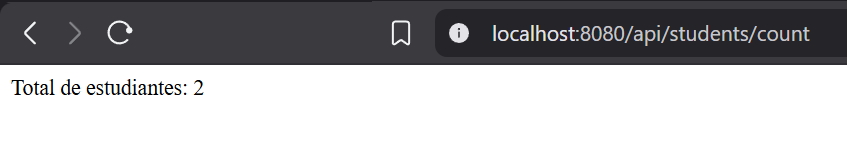

# Proyecto Spring Boot - API de Estudiantes

## Autor
- Nombre: Mateo Paez
- Materia: Programación y Plataformas Web

## Descripcion
Este proyecto consiste en una API REST desarrollada con Spring Boot para gestionar una lista simple de estudiantes almacenados en memoria. La aplicacion expone endpoints que permiten obtener todos los estudiantes registrados y consultar la cantidad total de estudiantes.

## Estructura implementada

### Modelo: Student.java

La clase `Student` representa la entidad estudiante y contiene los siguientes atributos:

- `id`: Identificador del estudiante.
- `name`: Nombre del estudiante.
- `age`: Edad del estudiante.

Además, incluye:
- Constructor parametrizado.
- Métodos `get` y `set` para cada atributo.

### Controlador: StudentController.java

El controlador `StudentController` expone los servicios REST bajo la ruta base:

```
/api/students
```

Al iniciar la aplicación se crean dos estudiantes de ejemplo:

| ID | Nombre | Edad |
|----|---------|------|
| 1 | Juan | 30 |
| 2 | Diego | 10 |

## Endpoints disponibles

### Obtener todos los estudiantes

```
GET /api/students
```

Respuesta esperada:

```json
[
  {
    "id": 1,
    "name": "Juan",
    "age": 30
  },
  {
    "id": 2,
    "name": "Diego",
    "age": 10
  }
]
```

### Obtener la cantidad de estudiantes

```
GET /api/students/count
```

Respuesta esperada:

```
Total de estudiantes: 2
```

## Evidencia de ejecucion

### Servidor Spring Boot en ejecucion

### Endpoint `/api/students`


### Endpoint `/api/students/count`




## Tecnologias utilizadas

- Java
- Spring Boot
- Spring Web
- Maven

## EndPoints a analizar

```
GET /api/students
GET /api/students/count
```

## Capturas de `GET` y `POST` en BRUNO

### Crear y Listar Usuarios


### Crear y Listar Productos


