# Proyecto Spring Boot - API de Estudiantes

## Autor
- Nombre: Mateo Paez
- Materia: Programación y Plataformas Web

## Descripcion
Este proyecto consiste en una API REST desarrollada con Spring Boot para gestionar una lista simple de estudiantes almacenados en memoria. La aplicacion expone endpoints que permiten obtener todos los estudiantes registrados y consultar la cantidad total de estudiantes.

## Estructura implementada

### Modelo: Student.java

La clase `Student` representa la entidad estudiante y contiene los siguientes atributos:

- `id`: Identificador del estudiante.
- `name`: Nombre del estudiante.
- `age`: Edad del estudiante.

Además, incluye:
- Constructor parametrizado.
- Métodos `get` y `set` para cada atributo.

### Controlador: StudentController.java

El controlador `StudentController` expone los servicios REST bajo la ruta base:

```
/api/students
```

Al iniciar la aplicación se crean dos estudiantes de ejemplo:

| ID | Nombre | Edad |
|----|---------|------|
| 1 | Juan | 30 |
| 2 | Diego | 10 |

## Endpoints disponibles

### Obtener todos los estudiantes

```
GET /api/students
```

Respuesta esperada:

```json
[
  {
    "id": 1,
    "name": "Juan",
    "age": 30
  },
  {
    "id": 2,
    "name": "Diego",
    "age": 10
  }
]
```

### Obtener la cantidad de estudiantes

```
GET /api/students/count
```

Respuesta esperada:

```
Total de estudiantes: 2
```

## Evidencia de ejecucion

### Servidor Spring Boot en ejecucion

### Endpoint `/api/students`


## Tecnologias utilizadas

- Java
- Spring Boot
- Spring Web
- Maven

## EndPoints a analizar

```
GET /api/students
GET /api/students/count
```

---

## Resolucion de Practicas

### Practica 01 - 02

Para iniciar el proyecto, se verifica que Java esté instalado y ejecuta la aplicación con Gradle. Una vez iniciada, el servidor quedará disponible en `http://localhost:8080` y podrás comprobar su funcionamiento accediendo al endpoint `/api/status`.

```bash
java -version
./gradlew bootRun
curl http://localhost:8080/api/status
```


---

### Practica 03

- Descripción

Este proyecto implementa una API REST básica en Spring Boot para gestionar usuarios mediante operaciones CRUD, utilizando controladores, DTOs, modelos y mappers para separar responsabilidades y mantener una arquitectura organizada. Durante esta práctica no se emplea una base de datos, por lo que la información se almacena temporalmente en memoria mediante una lista de objetos.

- Añadidos

Durante el desarrollo de la actividad, se recplico la creacion de los usuarios para la creacion de Productos, con las variables de nombre, stock y precio, ejecutando los endpoints correspondientes, en las capturas se evidencian los endpoints de `api/users` y la de `api/products`


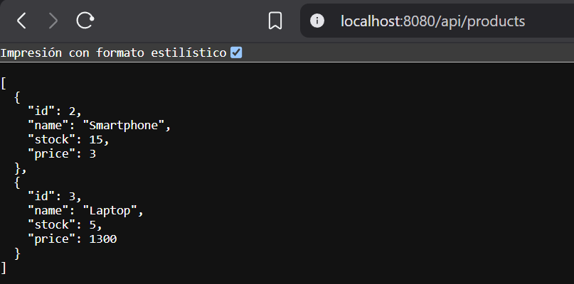

---

### Practica 04

- Descripcion

Esta práctica implementa una arquitectura más organizada para una API REST en Spring Boot mediante la incorporación de la capa de servicios y la inyección de dependencias. La lógica de negocio se traslada desde los controladores hacia clases anotadas con `@Service`, permitiendo que los controladores se limiten a recibir solicitudes HTTP y delegar las operaciones correspondientes. Además, se mantiene el uso de DTOs, modelos y mappers para separar responsabilidades y facilitar la mantenibilidad del código, utilizando almacenamiento temporal en memoria sin recurrir todavía a una base de datos.

- Pruebas en BRUNO

A continuación se incluyen las evidencias de las pruebas realizadas con Bruno para verificar el funcionamiento de los endpoints de la API REST. Las capturas muestran la ejecución de operaciones como creación, consulta, actualización y eliminación de recursos, comprobando que el controlador delega correctamente la lógica al servicio y que las respuestas se generan de forma adecuada.

##### -- Productos

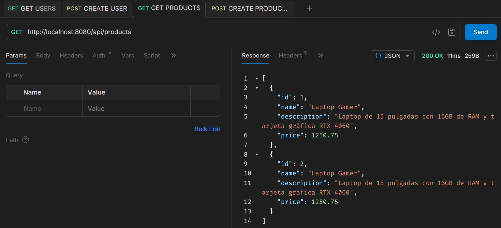

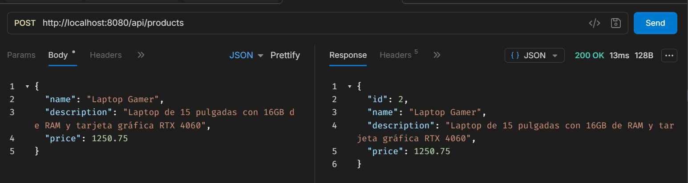

##### -- Users

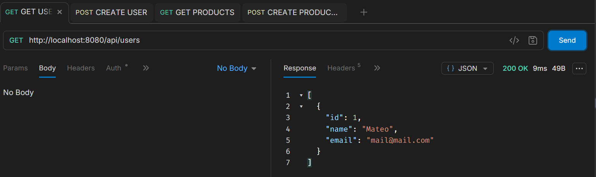

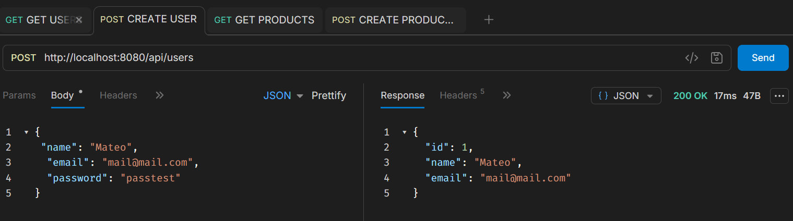

---

### Practica 05

- Descripcion

Esta práctica incorpora persistencia real de datos en una aplicación Spring Boot mediante PostgreSQL y Spring Data JPA. Se reemplaza el almacenamiento temporal en memoria por entidades JPA y repositorios, permitiendo que las operaciones CRUD se ejecuten directamente sobre una base de datos. Además, se mantiene una separación clara entre DTOs, modelos, entidades y servicios, utilizando mappers para transformar la información entre cada capa y una clase BaseEntity para centralizar atributos comunes de persistencia.

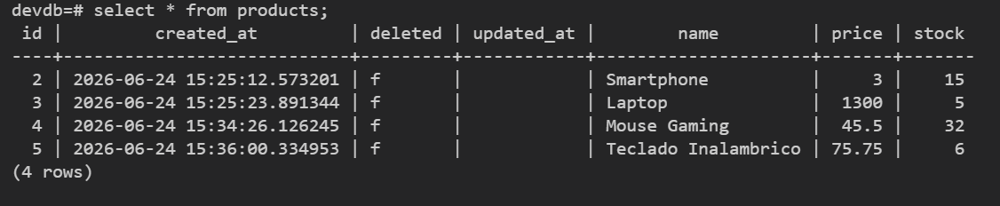

---

### Practica 06

- Descripcion

Esta práctica incorpora validación de datos de entrada en una API REST desarrollada con Spring Boot mediante Jakarta Validation. Se añaden restricciones sobre los DTOs para verificar que la información recibida cumpla requisitos como campos obligatorios, formatos válidos y valores mínimos antes de ejecutar la lógica de negocio o persistir los datos en la base de datos. Asimismo, se complementan estas verificaciones con reglas implementadas en los servicios y restricciones definidas en las entidades JPA para fortalecer la integridad de la información.


- Imagenes

En esta sección se muestran las evidencias obtenidas al probar las validaciones de la API utilizando Bruno. Las capturas incluyen casos de solicitudes válidas e inválidas, respuestas de error generadas por Spring Boot ante datos incorrectos y la verificación del funcionamiento correcto del CRUD cuando las entradas cumplen las reglas definidas.


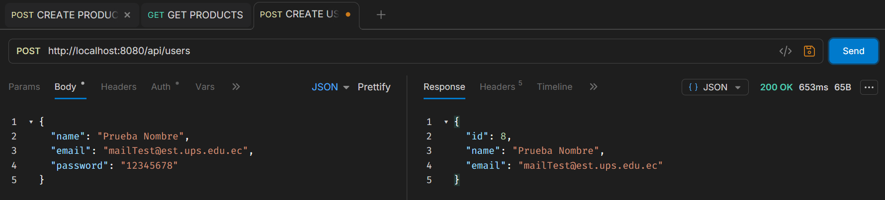

---

### Practica 07

- Descripcion

Esta práctica introduce el manejo centralizado de excepciones y la generación de respuestas de error consistentes en una aplicación Spring Boot. Se implementan mecanismos para capturar errores de validación, recursos inexistentes y reglas de negocio incumplidas mediante excepciones personalizadas y controladores globales, permitiendo que la API devuelva respuestas claras, estructuradas y adecuadas para el cliente sin exponer detalles internos de la aplicación.

- Resultados

En esta sección se presentan las evidencias obtenidas mediante pruebas realizadas con Bruno, mostrando tanto operaciones exitosas como distintos escenarios de error. Las capturas permiten verificar el correcto funcionamiento del manejo centralizado de excepciones, incluyendo respuestas ante validaciones fallidas, recursos no encontrados y otras situaciones controladas por la API.


---

### Practica 08

- Capturas

1. Captura de la descripción de la tabla products en PostgreSQL

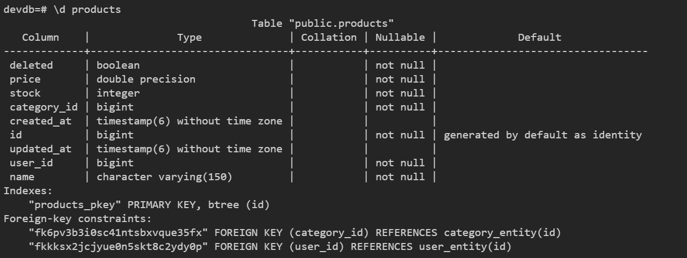

2. Captura de la creación de un producto con relaciones
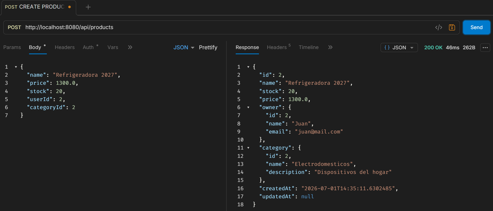

3. Captura de la consulta de productos por categoría
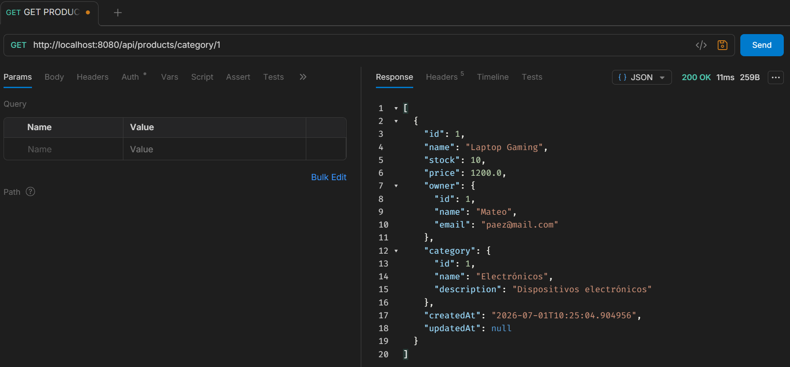

- Explicación breve

`ProductEntity` se relaciona con `UserEntity` y `CategoryEntity` mediante `@ManyToOne`, indicando que varios productos pueden pertenecer a un mismo usuario o categoría. La anotación `@JoinColumn` define las claves foráneas (`user_id` y `category_id`) que enlazan la tabla products con las tablas `users` y `categories`.

---

### Practica 09

- Capturas

**1. Captura de producto creado con varias categorías**
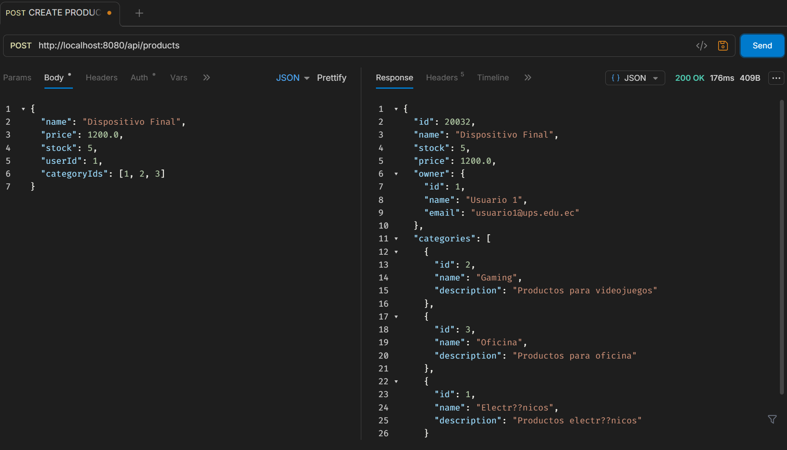

**2. Captura de consulta con filtros por usuario**
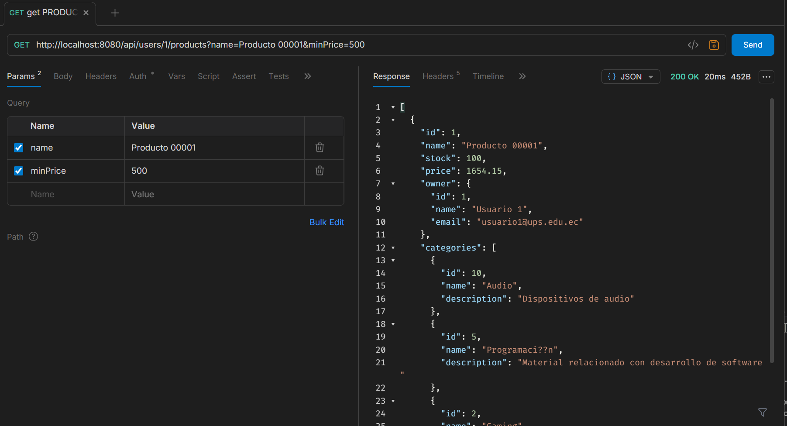

**3. Captura de consulta con filtros por categoría**
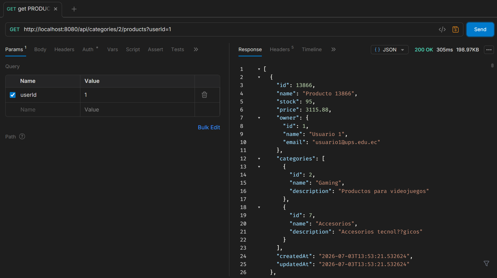

- Explicación breve

**1) ¿Por qué se usa ProductService y ProductRepository para consultar productos aunque el endpoint esté dentro del contexto ``/users/{id}/products o /categories/{id}/products``?**

Aunque la ruta expresa un contexto semántico basado en el usuario o la categoría para mantener una `API RESTFUL` e intuitiva, el recurso principal que se está consultando, filtrando y devolviendo son los productos. Por lo tanto, la responsabilidad de la lógica de negocio y el acceso a la base de datos recae estrictamente en `ProductService` y `ProductRepository`, respetando el principio de responsabilidad única de cada componente.

**2) ¿Qué cambió al pasar de Product N ─- 1 Category a Product N ── N Category?**

Se eliminó la relación directa que usaba una única clave foránea en la entidad de productos con la anotación `@ManyToOne`. En su lugar, se implementó una relación `@ManyToMany`, lo que genera automáticamente una tabla intermedia en la base de datos para enlazar ambas entidades sin duplicar registros. A nivel de código, el atributo individual `CategoryEntity category` se transformó en una colección `Set<CategoryEntity>` categories. Esto obligó a modificar los DTOs para recibir arreglos de IDs, cambiar los mappers para devolver listas de categorías y actualizar las consultas JPQL en los repositorios utilizando JOIN con la cláusula `DISTINCT` para evitar productos duplicados en los resultados.

---


### Practica 10

- Capturas

**1. Captura de respuesta con Page**
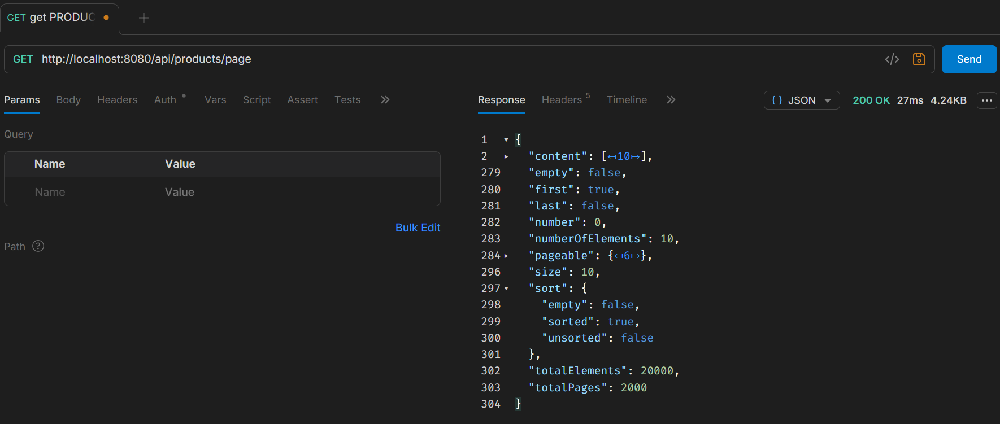

**2. Captura de respuesta con Slice**
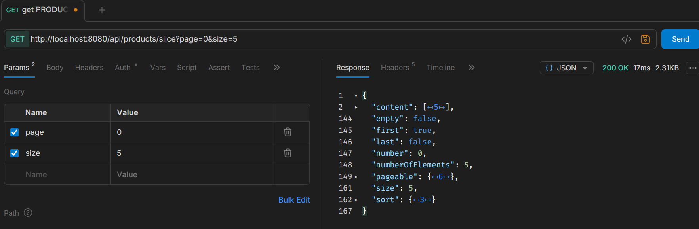

**3. Captura de error por paginación inválida**
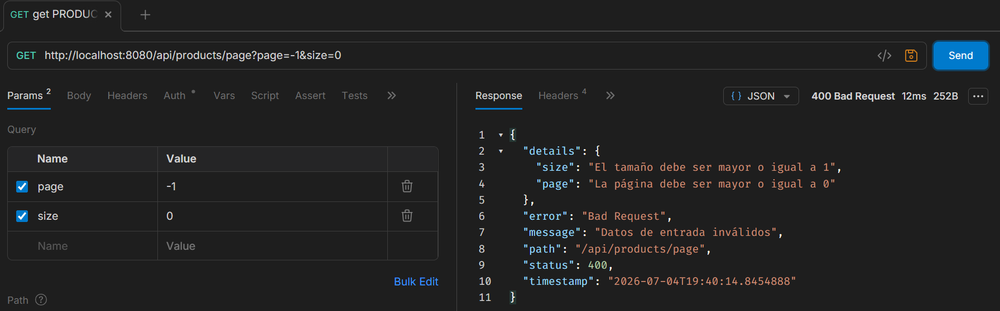

**4. Captura de endpoint de categoría paginado con Page**
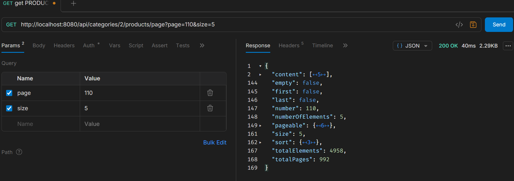

**5. Captura de endpoint de categoría paginado con Slice**
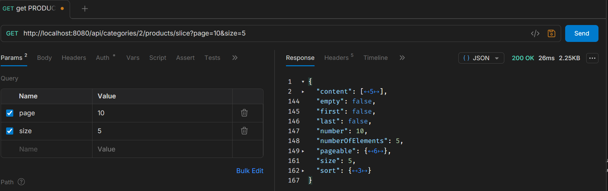

- Explicación breve

**1) ¿Cuál es la diferencia entre Page y Slice?**
Page representa una respuesta paginada completa e incluye metadatos como el total de elementos y el total de páginas. Para lograr esto, ejecuta dos consultas en la base de datos: una para obtener los datos con `LIMIT` y `OFFSET`, y otra de tipo `COUNT` para saber el tamaño total de la tabla. Por otro lado, Slice es una versión más ligera que no incluye el total de elementos ni páginas, ya que omite la consulta `COUNT`. Simplemente solicita un registro adicional a la base de datos para determinar si existe una página siguiente, siendo ideal y más eficiente para funcionalidades como navegación secuencial o scroll infinito.

**2) ¿Por qué la paginación debe aplicarse en el repositorio y no después de traer todos los datos en memoria?**
Si la paginación se realiza en memoria, el sistema intentará consultar y cargar todos los registros existentes desde la base de datos al backend simultáneamente. Esto genera un consumo excesivo de recursos, sobrecarga de red, lentitud y posibles caídas por falta de memoria. Al aplicar la paginación a nivel de repositorio usando Pageable, el motor de base de datos se encarga de filtrar la cantidad exacta de registros requeridos mediante comandos SQL, enviando al servidor únicamente la pequeña fracción de datos solicitada, lo que garantiza el rendimiento y la escalabilidad de la API.

---