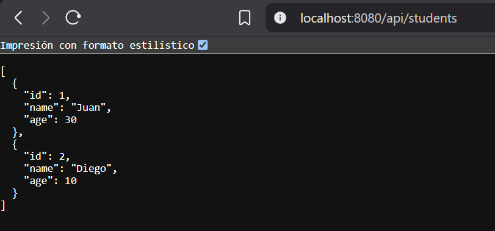
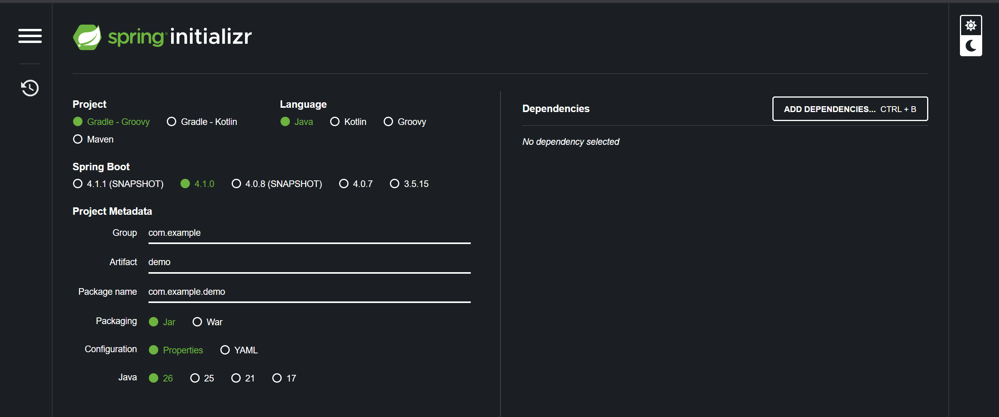
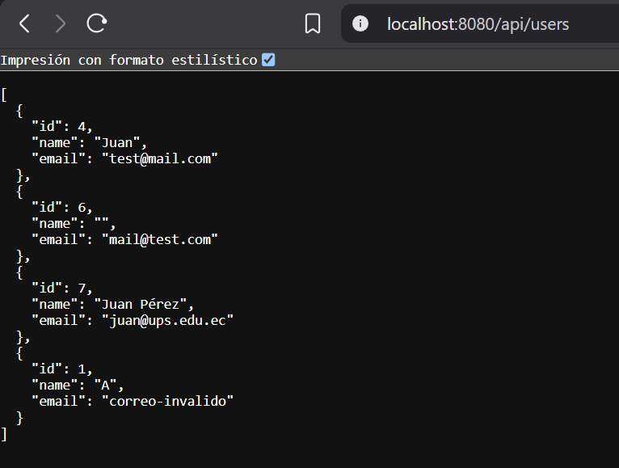
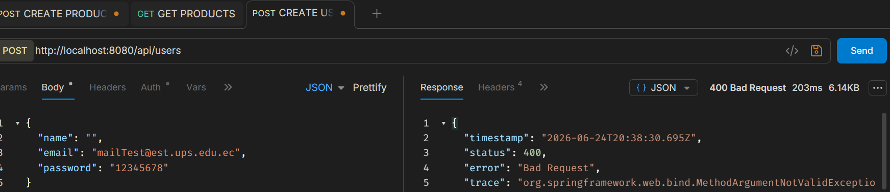
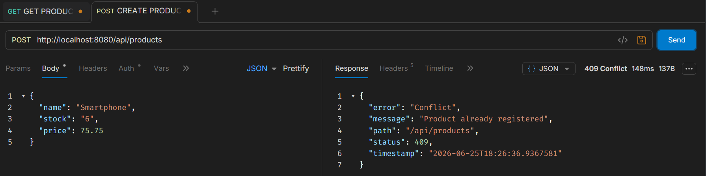
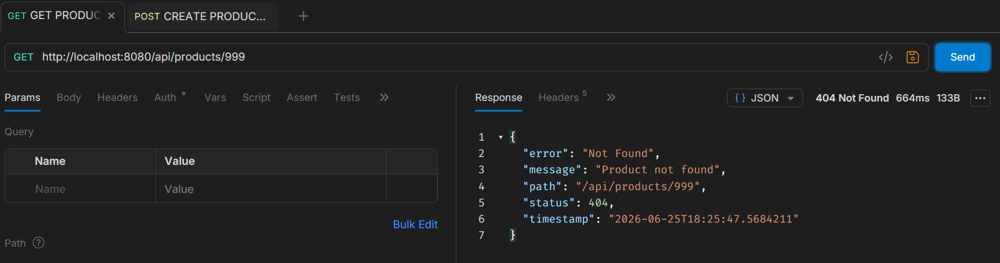

# Proyecto Spring Boot - API de Estudiantes

## Autor
- Nombre: Mateo Paez
- Materia: Programación y Plataformas Web

## Descripcion
Este proyecto consiste en una API REST desarrollada con Spring Boot para gestionar una lista simple de estudiantes almacenados en memoria. La aplicacion expone endpoints que permiten obtener todos los estudiantes registrados y consultar la cantidad total de estudiantes.

## Estructura implementada

### Modelo: Student.java

La clase `Student` representa la entidad estudiante y contiene los siguientes atributos:

- `id`: Identificador del estudiante.
- `name`: Nombre del estudiante.
- `age`: Edad del estudiante.

Además, incluye:
- Constructor parametrizado.
- Métodos `get` y `set` para cada atributo.

### Controlador: StudentController.java

El controlador `StudentController` expone los servicios REST bajo la ruta base:

```
/api/students
```

Al iniciar la aplicación se crean dos estudiantes de ejemplo:

| ID | Nombre | Edad |
|----|---------|------|
| 1 | Juan | 30 |
| 2 | Diego | 10 |

## Endpoints disponibles

### Obtener todos los estudiantes

```
GET /api/students
```

Respuesta esperada:

```json
[
  {
    "id": 1,
    "name": "Juan",
    "age": 30
  },
  {
    "id": 2,
    "name": "Diego",
    "age": 10
  }
]
```

### Obtener la cantidad de estudiantes

```
GET /api/students/count
```

Respuesta esperada:

```
Total de estudiantes: 2
```

## Evidencia de ejecucion

### Servidor Spring Boot en ejecucion

### Endpoint `/api/students`





## Tecnologias utilizadas

- Java
- Spring Boot
- Spring Web
- Maven

## EndPoints a analizar

```
GET /api/students
GET /api/students/count
```

---

## Resolucion de Practicas

### Practica 01 - 02

Para iniciar el proyecto, se verifica que Java esté instalado y ejecuta la aplicación con Gradle. Una vez iniciada, el servidor quedará disponible en `http://localhost:8080` y podrás comprobar su funcionamiento accediendo al endpoint `/api/status`.

```bash
java -version
./gradlew bootRun
curl http://localhost:8080/api/status
```




---

### Practica 03

- Descripción

Este proyecto implementa una API REST básica en Spring Boot para gestionar usuarios mediante operaciones CRUD, utilizando controladores, DTOs, modelos y mappers para separar responsabilidades y mantener una arquitectura organizada. Durante esta práctica no se emplea una base de datos, por lo que la información se almacena temporalmente en memoria mediante una lista de objetos.

- Añadidos

Durante el desarrollo de la actividad, se recplico la creacion de los usuarios para la creacion de Productos, con las variables de nombre, stock y precio, ejecutando los endpoints correspondientes, en las capturas se evidencian los endpoints de `api/users` y la de `api/products`




---

### Practica 04

- Descripcion

Esta práctica implementa una arquitectura más organizada para una API REST en Spring Boot mediante la incorporación de la capa de servicios y la inyección de dependencias. La lógica de negocio se traslada desde los controladores hacia clases anotadas con `@Service`, permitiendo que los controladores se limiten a recibir solicitudes HTTP y delegar las operaciones correspondientes. Además, se mantiene el uso de DTOs, modelos y mappers para separar responsabilidades y facilitar la mantenibilidad del código, utilizando almacenamiento temporal en memoria sin recurrir todavía a una base de datos.

- Pruebas en BRUNO

A continuación se incluyen las evidencias de las pruebas realizadas con Bruno para verificar el funcionamiento de los endpoints de la API REST. Las capturas muestran la ejecución de operaciones como creación, consulta, actualización y eliminación de recursos, comprobando que el controlador delega correctamente la lógica al servicio y que las respuestas se generan de forma adecuada.

##### -- Productos


##### -- Users


---

### Practica 05

- Descripcion

Esta práctica incorpora persistencia real de datos en una aplicación Spring Boot mediante PostgreSQL y Spring Data JPA. Se reemplaza el almacenamiento temporal en memoria por entidades JPA y repositorios, permitiendo que las operaciones CRUD se ejecuten directamente sobre una base de datos. Además, se mantiene una separación clara entre DTOs, modelos, entidades y servicios, utilizando mappers para transformar la información entre cada capa y una clase BaseEntity para centralizar atributos comunes de persistencia.


---

### Practica 06

- Descripcion

Esta práctica incorpora validación de datos de entrada en una API REST desarrollada con Spring Boot mediante Jakarta Validation. Se añaden restricciones sobre los DTOs para verificar que la información recibida cumpla requisitos como campos obligatorios, formatos válidos y valores mínimos antes de ejecutar la lógica de negocio o persistir los datos en la base de datos. Asimismo, se complementan estas verificaciones con reglas implementadas en los servicios y restricciones definidas en las entidades JPA para fortalecer la integridad de la información.


- Imagenes

En esta sección se muestran las evidencias obtenidas al probar las validaciones de la API utilizando Bruno. Las capturas incluyen casos de solicitudes válidas e inválidas, respuestas de error generadas por Spring Boot ante datos incorrectos y la verificación del funcionamiento correcto del CRUD cuando las entradas cumplen las reglas definidas.




---

### Practica 07

- Descripcion

Esta práctica introduce el manejo centralizado de excepciones y la generación de respuestas de error consistentes en una aplicación Spring Boot. Se implementan mecanismos para capturar errores de validación, recursos inexistentes y reglas de negocio incumplidas mediante excepciones personalizadas y controladores globales, permitiendo que la API devuelva respuestas claras, estructuradas y adecuadas para el cliente sin exponer detalles internos de la aplicación.

- Resultados

En esta sección se presentan las evidencias obtenidas mediante pruebas realizadas con Bruno, mostrando tanto operaciones exitosas como distintos escenarios de error. Las capturas permiten verificar el correcto funcionamiento del manejo centralizado de excepciones, incluyendo respuestas ante validaciones fallidas, recursos no encontrados y otras situaciones controladas por la API.





---